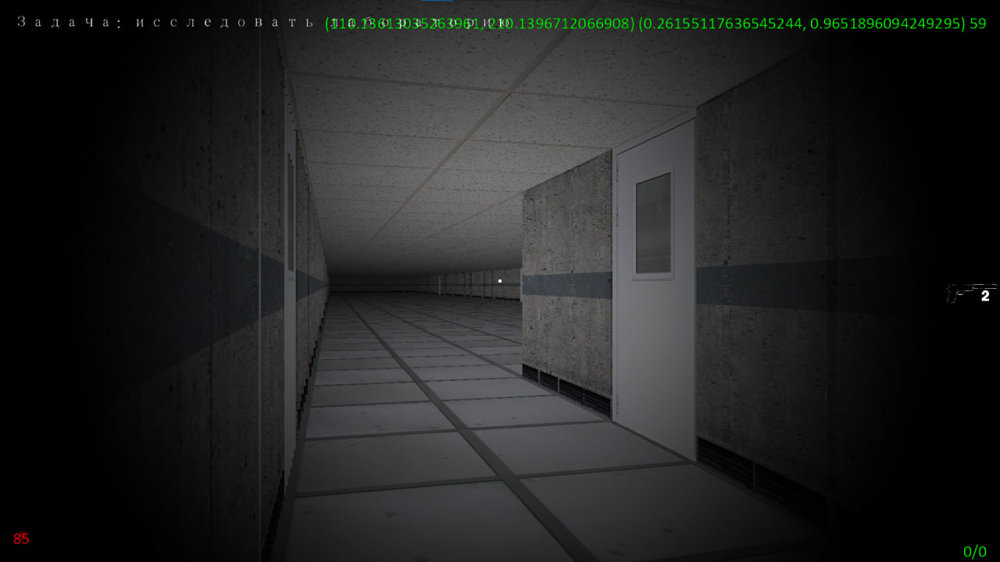
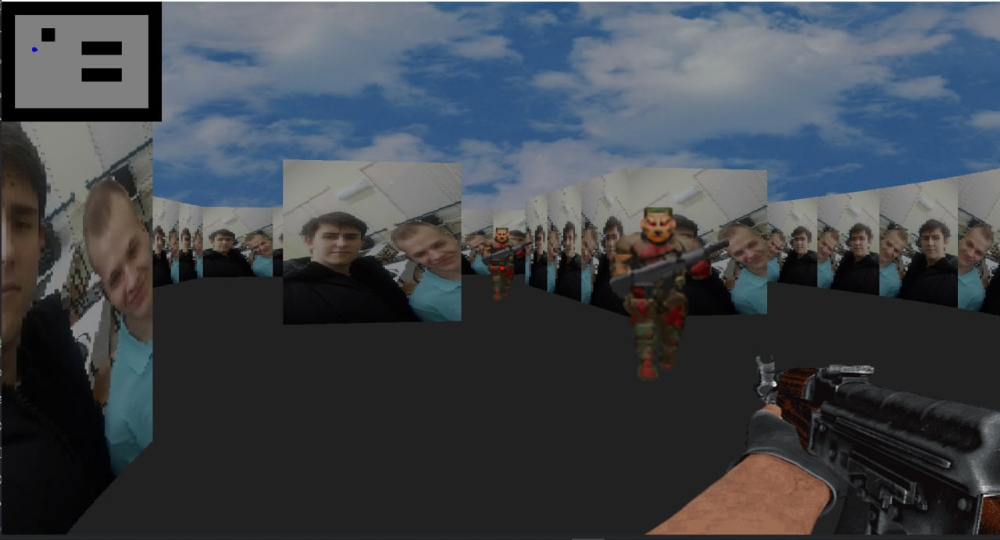

# CS 3


---

## 🎮 Об игре
Это шутер от первого лица. Несмотря на то, что движок **Arcade** является 2D-ориентированным, в проекте реализована честная математика лучей для отрисовки трехмерного пространства.

### 🖼️ Скриншоты геймплея
|             Лаборатория             |               Игровой процесс                |
|:-----------------------------------:|:--------------------------------------------:|
|  |  |

---

## 🛠 Технические особенности

### 1. Рендеринг (Raycasting)
* **FOV:** $\pi/2$ (90 градусов).
* **Шейдеры:** Использование фрагментных шейдеров для отрисовки пола и потолка.
* **Текстурирование:** Динамическое кэширование срезов текстур для стен и спрайтов врагов.

### 2. Искусственный интеллект (Pathfinding)
Враги не просто ходят за игроком, а используют:
* **Алгоритм BFS:** поиск кратчайшего пути по сетке.
* **Graph Building:** динамическое построение графа проходимых зон на основе текстовой карты уровня.

### 3. Оружейная система
Каждое оружие наследуется от базового класса `Gun`, что позволяет легко настраивать:
* Разброс и урон (голова/тело).
* Уникальные звуки выстрелов и перезарядки.
* Анимации отдачи.

---

## 📂 Структура файлов
| Файл | Описание                               |
| :--- |:---------------------------------------|
| `main_menu.py` | Точка входа, логика меню и эффектов.   |
| `pathfinding.py` | Логика поиска пути и графы.            |
| `enemy.py` | Cостояния врагов и их отрисовка.       |
| `settings.py` | Глобальные константы, FOV, разрешение. |
| `stage[1-4].py` | Уровни игры с уникальными картами.     |

---

## 🚀 Как запустить

### Установка зависимостей
Для работы игры необходимы сторонние библиотеки (arcade, pyglet и др.). Все они указаны в файле `requirements.txt`. Установите их командой:

```Bash
pip install -r requirements.txt
```
Далее запустите игру командой:
```Bash
python -m src.views.main_menu
```
